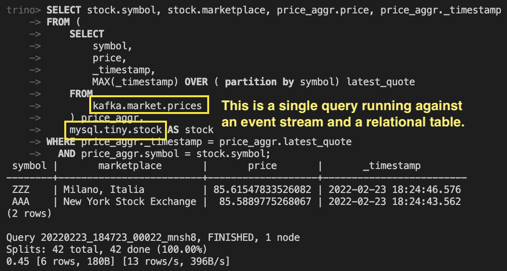

# data-mesh-trino

Is it possible to query relational and streaming data combined with SQL?

Yes, with a distributed query engine like Trino!



## start the services

```
docker-compose up -d
```

Open up http://localhost:8080/ (any username)

```
docker container exec -it $(docker ps | grep trino-coordinator | cut -d' ' -f1) trino
show catalogs;
show schemas in kafka;
show tables in kafka.market;
select * from kafka.market.prices;
```


## add data to the RDBMS

```
docker exec -i -t -u root $(docker ps | grep mysql | cut -d' ' -f1) /bin/bash  
mysql --user admin --password --database tiny
=> admin
CREATE TABLE stock (id INTEGER PRIMARY KEY, symbol VARCHAR(8), marketplace VARCHAR(100));
INSERT INTO stock VALUES (1, 'AAA', 'New York Stock Exchange');
INSERT INTO stock VALUES (2, 'ZZZ', 'Milano, Italia');
```

## add data top the stream

```
docker-compose up --build producer
```
_This creates two quotes for two stocks. Also play with the payload in `producer/app.py`_

## run queries

**MySQL**

```
trino> SELECT * FROM mysql.tiny.stock; 
 id | symbol |       marketplace       
----+--------+-------------------------
  1 | AAA    | New York Stock Exchange 
  2 | ZZZ    | Milano, Italia          
(2 rows)
```

**Kafka**

```
trino> SELECT symbol, price, _timestamp, _message FROM kafka.market.prices;
 symbol |       price        |       _timestamp        |                    _message                    
--------+--------------------+-------------------------+------------------------------------------------
 AAA    |  35.52325553957573 | 2022-02-23 18:24:37.460 | {"symbol": "AAA", "price": 35.52325553957573}  
 ZZZ    | 11.955512826581005 | 2022-02-23 18:24:40.551 | {"symbol": "ZZZ", "price": 11.955512826581005} 
 AAA    |   85.5889775268067 | 2022-02-23 18:24:43.562 | {"symbol": "AAA", "price": 85.5889775268067}   
 ZZZ    |  85.61547833526082 | 2022-02-23 18:24:46.576 | {"symbol": "ZZZ", "price": 85.61547833526082}  
(4 rows)

Query 20220223_184546_00019_mnsh8, FINISHED, 1 node
Splits: 9 total, 9 done (100.00%)
0.24 [4 rows, 180B] [16 rows/s, 763B/s]
```

## run a distributed query across different data sources!

This lets us select from both a Kafka stream and a relational table.
Notice the `  MAX( field ) OVER ( PARTITION BY other-field )` syntax which for
sure is extremely valueable to reduce the events in Kafka to the latest,
highest, average, whatsoever aggregate.

```
SELECT stock.symbol, stock.marketplace, price_aggr.price, price_aggr._timestamp
FROM (
    SELECT 
        symbol, 
        price, 
        _timestamp, 
        MAX(_timestamp) OVER ( partition by symbol) latest_quote
    FROM 
        kafka.market.prices
    ) price_aggr,
    mysql.tiny.stock AS stock
WHERE price_aggr._timestamp = price_aggr.latest_quote
  AND price_aggr.symbol = stock.symbol;
```

```
 symbol |       marketplace       |       price       |       _timestamp        
--------+-------------------------+-------------------+-------------------------
 AAA    | New York Stock Exchange |  85.5889775268067 | 2022-02-23 18:24:43.562 
 ZZZ    | Milano, Italia          | 85.61547833526082 | 2022-02-23 18:24:46.576 
(2 rows)

Query 20220223_184019_00015_mnsh8, FINISHED, 1 node
Splits: 42 total, 42 done (100.00%)
0.55 [6 rows, 180B] [10 rows/s, 330B/s]
```


# Reference
https://github.com/bitsondatadev/trino-getting-started